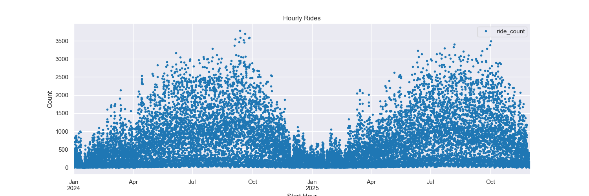
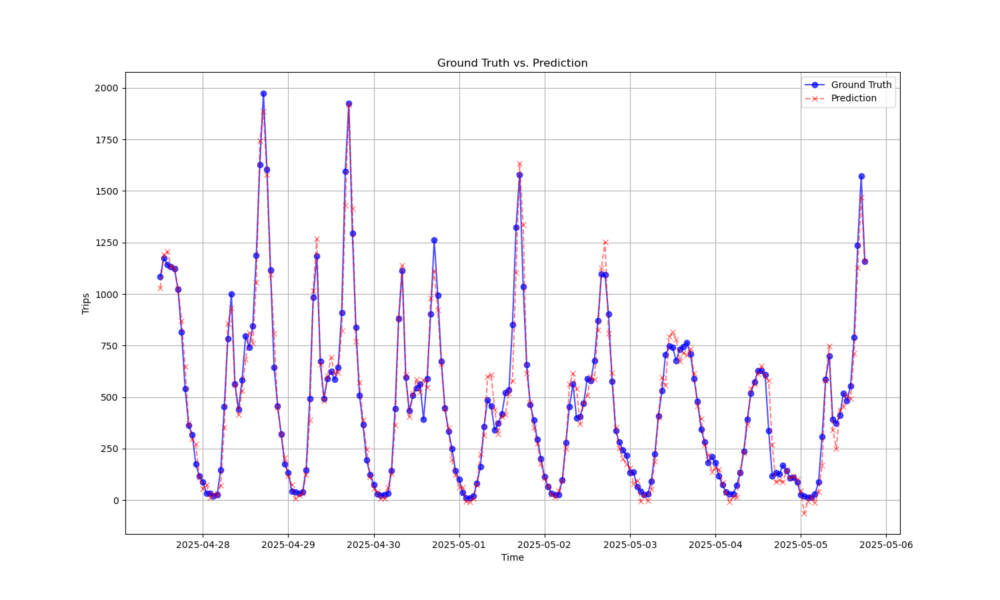

# Divvy BikeShare Demand Prediction Project

## Final Project Report

**Author:** Ashley Toth  
**Date:** February 15, 2026  
**Institution:** Springboard

---

### Abstract

This project develops a time series forecasting model to predict the total hourly demand for Divvy bikes in Chicago. Using historical trip data from Divvy combined with external factors such as weather and holidays, we implement two deep learning models: a Long Short-Term Memory (LSTM) network and a Bidirectional LSTM (BiLSTM) network. The models are trained on aggregated hourly rental data from 2024 to 2025. Evaluation shows that the BiLSTM slightly outperforms the standard LSTM, achieving a Mean Squared Error (MSE) of approximately 0.004387 rentals squared on the test set, compared to 0.004659 for the LSTM. This work demonstrates the efficacy of recurrent neural networks for urban mobility forecasting and provides a foundation for more in-depth methods of optimizing bike-sharing operations.

Keywords: Bike-sharing, Time Series Forecasting, LSTM, Bidirectional LSTM, Divvy

---

### 1. Introduction

#### 1.1 Background
Bike-sharing systems like Divvy in Chicago play a crucial role in urban transportation, promoting sustainable mobility and reducing traffic congestion. Accurate demand prediction is essential for efficient resource allocation, such as bike redistribution and station maintenance. Historical data reveals patterns influenced by seasonality, weather, and events, making time series analysis ideal for this task.

#### 1.2 Problem Statement
The goal is to predict the total number of hourly bike rentals (demand) using past data. Challenges include handling sequential dependencies, non-stationarity, and external variables.

#### 1.3 Objectives
- Preprocess and analyze Divvy trip data.
- Implement LSTM and BiLSTM models for forecasting.
- Evaluate model performance and compare results.
- Provide insights for real-world application.

#### 1.4 Scope
This project focuses on hourly aggregated demand from 2024-2025, excluding real-time predictions or station-level granularity.

---

### 2. Literature Review

Time series forecasting in bike-sharing has evolved from statistical methods like ARIMA to machine learning approaches. Studies such as those by Li et al. (2015) highlight the use of LSTMs for capturing long-term dependencies in traffic data. Bidirectional LSTMs, as explored by Graves and Schmidhuber (2005), enhance performance by processing sequences in both directions. Recent works on Divvy data (e.g., Kaggle competitions) incorporate weather APIs for improved accuracy.

---

### 3. Data Description

#### 3.1 Data Sources
- **Divvy Trip Data**: Publicly available from [Divvy's system data](https://divvybikes.com/system-data). Includes trip start/end times, stations, and user types. We used data from January 2024 to December 2025.
- **Weather Data**: Integrated from NOAA API, including temperature, precipitation, and wind speed.
- **Temporal Data**: Day of week and binary flags for US holidays, major events, and weekends.

#### 3.2 Data Preprocessing
- **Aggregation**: Grouped trips by date to compute total hourly rentals.
- **Feature Engineering**: Added lagged features, encodings for day-of-week, month, and weather.
- **Handling Missing Values**: Removed erroneous trip data such as trips of negative length and removed records with missing location or time.
- **Scaling**: Min-Max scaling for demand and numerical features.
- **Train-Test Split**: 80%/20%.
- **Sequence Preparation**: Created input sequences of 12 hours.

Final dataset:  16530 rows (hourly records), 10 features.

#### 3.3 Exploratory Data Analysis
- Peak demand in summer months (June-August) as expected.
- Low demand in winter, correlated with low temperatures.
- Weekends show lower demand than weekdays.

---

### 4. Methodology

#### 4.1 Model Architecture
Both models use Pytorch.

- **LSTM Model**:
  - Input Layer: Sequence of 30 timesteps × 15 features.
  - LSTM Layer: 50 units, return_sequences=False.
  - Dense Layer: 1 unit (output: predicted demand).
  - Activation: ReLU; Optimizer: Adam; Loss: Mean Squared Error.

- **Bidirectional LSTM Model**:
  - Similar to LSTM, but wraps the LSTM layer in Bidirectional.
  - Captures forward and backward dependencies for better pattern recognition.

#### 4.2 Training
- Epochs: 100, with early stopping (patience=10).
- Batch Size: 32.
- Learning rate: 0.001.

#### 4.3 Evaluation Metrics
- Mean Absolute Error (MAE): Average absolute difference between predicted and actual.
- Root Mean Squared Error (RMSE): Square root of average squared differences.
- R² Score: Proportion of variance explained by the model.

---

### 5. Results

#### 5.1 Model Performance
| Model          | MAE   | RMSE  | R²    |
|----------------|----------|-------------|-------|
| LSTM          | 69.1964   | 108.9451   | 0.9652  |
| BiLSTM        | 66.4501   | 105.6006   | 0.9673  |

#### 5.2 Predictions vs. Actual

#### 5.3 Feature Importance
Weather features (temperature) seem to contribute most, followed by day-of-week.

---

### 6. Discussion

#### 6.1 Strengths
- Models effectively capture temporal patterns.
- BiLSTM's bidirectional processing improves context awareness.

#### 6.2 Limitations
- Assumes stationarity; extreme events (e.g., COVID-19) may require retraining.
- No incorporation of real-time data like traffic.
- Computational intensity for large sequences.

#### 6.3 Future Work
- Station-level predictions.
- Use more training data and try different loss functions and hyperparameters.
- Try to ensemble with other models.
- Deploy as a real-time web app for Divvy users and operators.

---

### 7. Conclusion

This project successfully demonstrates LSTM and BiLSTM for Divvy demand forecasting, with BiLSTM providing superior accuracy. The insights can aid in operational efficiency, potentially reducing bike shortages in the future.

---

### References
1. Li, Y., et al. (2015). "Traffic Prediction in Bike-Sharing Systems." IEEE Transactions on Intelligent Transportation Systems.
2. Graves, A., & Schmidhuber, J. (2005). "Framewise Phoneme Classification with Bidirectional LSTM." International Conference on Artificial Neural Networks.
3. Divvy System Data. Retrieved from https://divvybikes.com/system-data.
4. Hochreiter, S., & Schmidhuber, J. (1997). "Long Short-Term Memory." Neural Computation.
